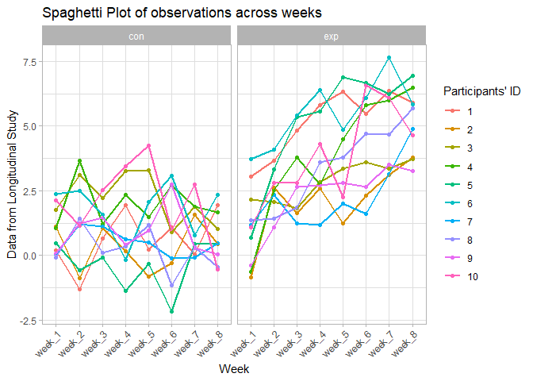
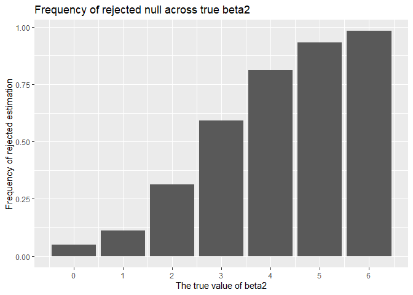

p8105\_hw5\_jg4197
================
Jin Ge
10/31/2019

## problem 1 filling in the missing values

``` r
set.seed(10)

iris_with_missing = iris %>% 
  map_df(~replace(.x, sample(1:150, 20), NA)) %>%
  mutate(Species = as.character(Species))

add_missing <- function(df){
  if(is.numeric(df)){
    df = replace_na(df, mean(df, na.rm = TRUE))
  } else if(is.character(df)){
    df = replace_na(df, "virginica")
  }
}

map_df(iris_with_missing, add_missing)
```

    ## # A tibble: 150 x 5
    ##    Sepal.Length Sepal.Width Petal.Length Petal.Width Species
    ##           <dbl>       <dbl>        <dbl>       <dbl> <chr>  
    ##  1         5.1          3.5         1.4         0.2  setosa 
    ##  2         4.9          3           1.4         0.2  setosa 
    ##  3         4.7          3.2         1.3         0.2  setosa 
    ##  4         4.6          3.1         1.5         1.19 setosa 
    ##  5         5            3.6         1.4         0.2  setosa 
    ##  6         5.4          3.9         1.7         0.4  setosa 
    ##  7         5.82         3.4         1.4         0.3  setosa 
    ##  8         5            3.4         1.5         0.2  setosa 
    ##  9         4.4          2.9         1.4         0.2  setosa 
    ## 10         4.9          3.1         3.77        0.1  setosa 
    ## # ... with 140 more rows

## problem 2 making plot

``` r
## input files
long_file <- list.files("./hw5_data/data", full.names = TRUE)

## read files
long_data <- map_df(long_file, read_csv)

## tidy the result
data_df <- data_frame(long_file) %>% 
  bind_cols(long_data) %>% 
  mutate(long_file = str_remove(long_file, "./hw5_data/data/"),
         long_file = str_remove(long_file, ".csv")) %>% 
  select(group_id = long_file, everything()) %>% 
  pivot_longer(week_1:week_8,
               names_to = "week",
               values_to = "data") %>% 
  separate(group_id, c("group", "id"), sep = "_", convert = TRUE) %>% 
  mutate(id = factor(id))


## making a plot for longitude data
data_df %>% 
  ggplot(aes(x = week, y = data, group = id)) +
  geom_point(aes(color = id)) + geom_line(aes(color = id), size = .8) +
  facet_wrap(group ~.) + theme_light() + 
  theme(axis.text.x = element_text(angle = 45, hjust = 1)) +
  labs(
    title = "Spaghetti Plot of observations across weeks",
    x = "Week",
    y = "Data from Longitudinal Study",
    col = "Participants' ID"
  )
```

<!-- -->

  - Totally, the baseline of two groups are almost equal, however, the
    experimental arm increases more and the current is increaseing in a
    wave pattern. The control arm can be regarded as keeping at one
    level.

## problem 3 conducting simulation

``` r
sim_model <- function(beta1, beta0 = 2, n = 30){
   sim_data = tibble(
     x = rnorm(n, mean = 0, sd = 1),
     y = beta0 + beta1 * x + rnorm(n, mean = 0, sd = sqrt(50))
   )
   
   fit_line = lm(y~x, data = sim_data)
   
   tidy_test = broom::tidy(fit_line)
   
   tibble(beta1_hat = tidy_test[[2,2]],
          p_value = tidy_test[[2,5]])
}

output <- vector("list", length = 10000)
for(i in 1:10000){
  output[[i]] = sim_model(0)
}
sim_result0 <- bind_rows(output)
sim_result0
```

    ## # A tibble: 10,000 x 2
    ##    beta1_hat  p_value
    ##        <dbl>    <dbl>
    ##  1     2.02  0.207   
    ##  2     1.23  0.182   
    ##  3     0.603 0.606   
    ##  4     3.03  0.000149
    ##  5    -1.19  0.471   
    ##  6    -1.49  0.219   
    ##  7    -1.97  0.192   
    ##  8     0.331 0.769   
    ##  9     0.576 0.670   
    ## 10     2.40  0.134   
    ## # ... with 9,990 more rows

``` r
## repeat for beta1=0,1,2,3,4,5,6
rerun_f <- function(beta1){
  rerun(10000, sim_model(beta1))
}

sim_result <- 
  tibble(beta1_true = c(0,1,2,3,4,5,6)) %>% 
  mutate(estimate_df = map(.x = beta1_true, ~rerun_f(beta1 = .x)),
         output_df = map(estimate_df, bind_rows)) %>%
  select(-estimate_df) %>% 
  unnest(output_df)


### making plot for rejected null across beta2
sim_result %>% 
  group_by(beta1_true) %>% 
  summarize(obs_n = n(),
            freq_reject = sum(p_value < 0.05)/obs_n) %>% 
  ggplot(aes(x = beta1_true, y = freq_reject)) + geom_bar(stat = "identity") +
  scale_x_continuous(breaks = c(0,1,2,3,4,5,6)) +
  labs(
    title = "Frequency of rejected null across true beta2",
    x = "The true value of beta2",
    y = "Frequency of rejected estimation"
  )
```

<!-- -->

``` r
# Comment: As the effect size increases, the frequency of rejecting the null increases and has the quickiest increasing rate during the effect size between 1 to 4


### making plot
reject_mean <- sim_result %>% 
  filter(p_value < 0.05) %>% 
  group_by(beta1_true) %>% 
  summarise(average = mean(beta1_hat))

sim_result %>% 
  group_by(beta1_true) %>% 
  summarize(average = mean(beta1_hat)) %>% 
  ggplot(aes(x = beta1_true, y = average)) + geom_bar(stat = "identity", fill = "yellow") + 
  geom_bar(data = reject_mean, stat = "identity", alpha = .55, fill = "purple") + 
  labs(
    title = "Bar plot of average estimates of beta1",
    x = "Average estimates of beta1",
    y = "The true value"
  ) + 
  scale_x_continuous(breaks = c(0,1,2,3,4,5,6)) + theme_classic()
```

<!-- -->

``` r
# Comment: the sample average of estimates across tests for which the null is rejected does not completely equal to the true value. The difference between two becomes small when true value increases. When true values is zero, the avarage of all estimates is zero and rejected avarage is below zero.

# Reason: the true value is not equal to zero that means the true result of hypothesis testing is rejecting. The rejecting estimates should be far more different from the true value. Therefore, the avarage rejected estimates should be larger than true value.
```
